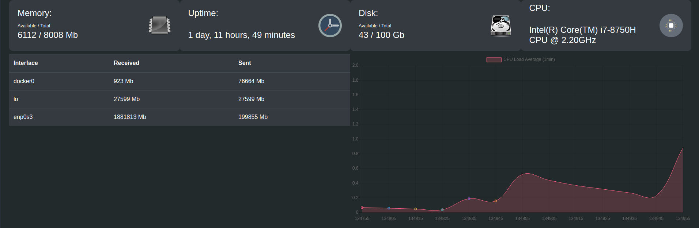

# GrafGo
Simple monitoring system to monitor your UNIX based system. Highly inspired by [rtop-vis](https://github.com/rapidloop/rtop-vis).   

  

## Credits  
Dashboard icons are from [Iconfider](https://www.iconfinder.com/)  
[Memmory Icon](https://www.iconfinder.com/icons/17978/memory_microchip_processor_ram_icon)  
[Clock Icon](https://www.iconfinder.com/icons/299080/clock_icon)  
[Disk Icon](https://www.iconfinder.com/icons/17929/disk_harddrive_icon)  
[CPU Icon](https://www.iconfinder.com/icons/531884)  

